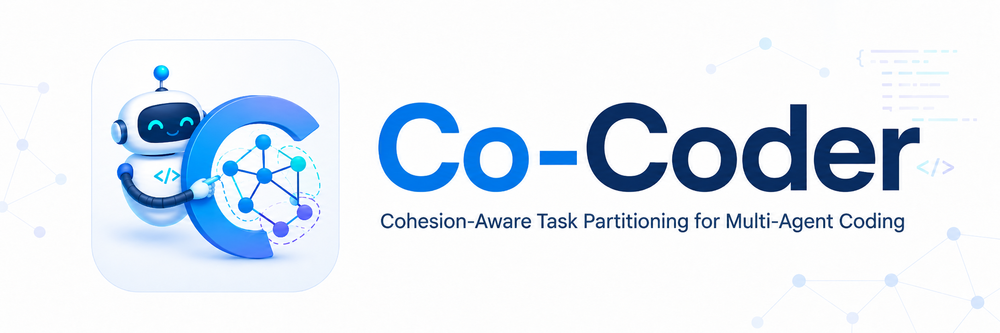
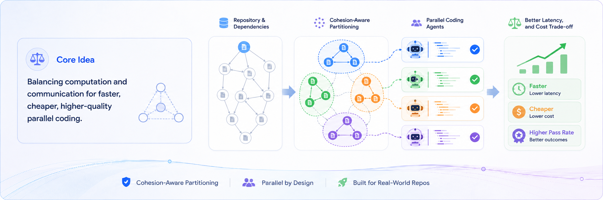

# When Parallelism Pays Off: Cohesion-Aware Task Partitioning for Multi-Agent Coding

<p align="center">
  
</p>

<p align="center">
  <a href="https://arxiv.org/abs/2606.00953">
    
  </a>
  <a href="#benchmarks">
    
  </a>
  <a href="#quick-start">
    
  </a>
</p>

<p align="center">
  <b>Xu Yang</b><sup>*1</sup>&nbsp;&nbsp;
  <b>Lunyiu Nie</b><sup>*1</sup>&nbsp;&nbsp;
  <b>Ethan Chandra</b><sup>1</sup>&nbsp;&nbsp;
  <b>Stanislav Gannutin</b><sup>1</sup>&nbsp;&nbsp;
  <b>Fangru Lin</b><sup>2</sup>&nbsp;&nbsp;
  <b>Swarat Chaudhuri</b><sup>1</sup>
</p>
<p align="center">
  <sup>1</sup>The University of Texas at Austin&nbsp;&nbsp;
  <sup>2</sup>University of Oxford
</p>
<p align="center">
  <sup>*</sup>Equal Contribution
</p>

Multi-agent LLM systems offer a way to decompose complex tasks such as coding through parallelization and context isolation. However, adding agents in practice introduces inter-agent communication overhead, which incurs extra cost and can sometimes offset the efficiency gains.

**Cohesion-aware Coder (Co-Coder)** formalizes multi-agent orchestration as a graph partitioning problem that captures the *communication-to-computation trade-off*. It builds dependency graphs from static analysis, isolates structural hub files, partitions the graph via community detection, and executes the partition with a dependency-aware scheduler.

<p align="center">
  
</p>

## Key Results

Across 28 real-world projects on DevEval and CodeProjectEval, Co-Coder advances the Pareto frontier over sequential and file-based parallel baselines as well as Claude Code with Agent Teams.

|  | DevEval (10 projects) | CodeProjectEval (18 projects) |
|--|----------------------|-------------------------------|
| **Pass rate** | 56.8% &rarr; 68.1% (+11.3%) | 20.1% &rarr; 34.1% (+14.0%) |
| **Wall-clock speedup** | 1.81x | 2.10x |
| **API cost reduction** | 28% | 35% |

The largest gains appear on the most dependency-dense projects. All experiments use `gpt-5-mini` as the base model, evaluated over three independent runs.

## Table of Contents

- [Quick Start](#quick-start)
- [Architecture](#architecture)
- [Pipelines](#pipelines)
- [Benchmarks](#benchmarks)
- [Configuration](#configuration)
- [Project Structure](#project-structure)
- [Citing Us](#citing-us)
- [License](#license)

## Quick Start

### Prerequisites

- **Python 3.10+**
- **Conda** (recommended)

### Install

```bash
git clone https://github.com/CoCoder-Agent/CoCoder.git && cd CoCoder

conda create -n cocoder python=3.12 -y
conda activate cocoder

pip install -r code_team/requirements.txt
```

### Configure

```bash
cp .env.example .env
# Edit .env with your LLM provider credentials (OpenAI, Anthropic, Bedrock, etc.)
```

Co-Coder is built on [OpenHands SDK](https://github.com/All-Hands-AI/OpenHands) and uses [LiteLLM](https://github.com/BerriAI/litellm) for model routing, so any LiteLLM-compatible model works. See `.env.example` for provider examples.

### Run Baselines

```bash
cd code_team

# Sequential (single agent, generates RIB autonomously)
python -m codebase run --dataset DevEval --repo ArXiv_digest

# File-based Parallel
python -m parallelbase run --dataset DevEval --repo ArXiv_digest

# Optionally provide a pre-computed RIB to skip the generation step
python -m codebase run --dataset DevEval --repo ArXiv_digest \
  --rib-file path/to/rib.json

# List available repos
python -m codebase list --dataset DevEval
```

### Run Co-Coder

Co-Coder requires a RIB with dependency information for graph partitioning. You can either provide a pre-computed RIB file or generate dependencies on-the-fly.

```bash
# Use a pre-computed RIB file
python -m cohesionbase run --dataset DevEval --repo ArXiv_digest \
  --rib-file path/to/rib.json

# Or generate RIB dependencies on-the-fly
python -m cohesionbase run --dataset DevEval --repo ArXiv_digest \
  --rib-dep-tool
```

### Evaluate

```bash
python run_unit_tests.py <path-to-run-dir>

# With per-test timeout
python run_unit_tests.py <path-to-run-dir> --timeout 120
```

> **Note:** `TEST_PYTHON_PATH` must be set in `.env` pointing to a Python 3.10 interpreter.

## Architecture

Co-Coder's pipeline consists of three stages:

### 1. Graph Construction

The LLM produces a **Repository Interface Blueprint (RIB)** -- a structured outline at file granularity. For each file, the RIB enumerates symbols (classes, function signatures, constants) and import dependencies. Edge weights are computed from symbol sharing via cosine similarity.

### 2. Cohesion-Based Graph Partitioning

Given the weighted dependency graph, Co-Coder partitions it to minimize the joint cost `T(P) = W(P) + alpha * C(P)`, where `W(P)` is the critical-path computation cost and `C(P)` is the cross-partition communication cost.

The partitioning runs in three steps:

1. **Structural Hub Isolation** -- Separate *in-hubs* (widely depended-upon utilities) and *out-hubs* (top-level aggregators) so they don't distort community detection.
2. **Community Detection** -- Cluster remaining files using Infomap, which minimizes the description length of a random walk on the directed graph.
3. **Latent Parallelism Exploitation** -- Lift independent leaf files out of their clusters to expose parallelism without increasing communication cost.

### 3. Dependency-Aware Parallel Execution

Each partition group is assigned to one coding agent. Files are managed through a **shared task list**: each file advances from *pending* to *ready* once its upstream dependencies complete, then gets picked up by its group's agent. No global synchronization barriers.

After all files are generated, a leader agent runs the test suite and dispatches repair requests partition-by-partition.

## Pipelines

| Pipeline | Module | Description |
|----------|--------|-------------|
| **Sequential** | `codebase` | Single agent generates the entire repository |
| **File-based Parallel** | `parallelbase` | One agent per file, no structural partitioning |
| **Co-Coder** | `cohesionbase` | Cohesion-based graph partitioning + dependency-aware scheduling |
| **RIB Generator** | `ribgensim` | Standalone RIB generation tool |
| **Claude Code Agent Team** | `claude_code_agent_team` | External baseline using Claude Code CLI |

## Benchmarks

### DevEval

Python subset of 10 projects, whose ground-truth reference implementations average 3.1 files and 243 LOC. Compact repositories for end-to-end agent pipeline evaluation. (Dataset directory: `datasets/DevEval/`)

### CodeProjectEval

18 projects curated from real-world open-source libraries, with reference implementations averaging 11.9 files and 2,371 LOC per project. Deep cross-file dependencies and large integration surfaces. (Dataset directory: `datasets/CodeProjectEval/`)

Both benchmarks ship with unit tests for automated evaluation.

## Configuration

All configuration is via environment variables in `.env`. Key settings:

| Variable | Description |
|----------|-------------|
| `LLM_MODEL` | LiteLLM model identifier (e.g. `openai/gpt-5-mini`) |
| `LLM_API_KEY` | API key for the LLM provider |
| `LLM_BASE_URL` | Custom API endpoint (for proxies, Azure, etc.) |
| `RIB_DEP_MODEL` | Override model for `--rib-dep-tool` (defaults to `LLM_MODEL`) |
| `TEST_PYTHON_PATH` | Python 3.10 interpreter for test venvs |

See `.env.example` for the full list with provider-specific examples.

## Project Structure

```
CoCoder/
  code_team/
    codebase/          # Sequential (single-agent) pipeline
    parallelbase/      # File-based parallel pipeline
    cohesionbase/      # Co-Coder pipeline (this paper)
      partition/       # Graph partitioning algorithms
      tools/           # partition_into_groups, read_rib, shared_task_list
    common/            # Shared utilities, config, prompts
    ribgensim/         # Standalone RIB generator
    claude_code_agent_team/  # Claude Code baseline
  datasets/
    DevEval/          # DevEval benchmark tasks
    CodeProjectEval/   # CodeProjectEval benchmark tasks
    depanalysis/       # Pre-computed RIB ground truths
```

## Citing Us

```bibtex
@misc{yang2026parallelismpaysoffcohesionaware,
      title={When Parallelism Pays Off: Cohesion-Aware Task Partitioning for Multi-Agent Coding}, 
      author={Xu Yang and Lunyiu Nie and Ethan Chandra and Stanislav Gannutin and Fangru Lin and Swarat Chaudhuri},
      year={2026},
      eprint={2606.00953},
      archivePrefix={arXiv},
      primaryClass={cs.LG},
      url={https://arxiv.org/abs/2606.00953}, 
}
```

## License

This project is licensed under the Apache License 2.0. See [LICENSE](LICENSE) for details.
